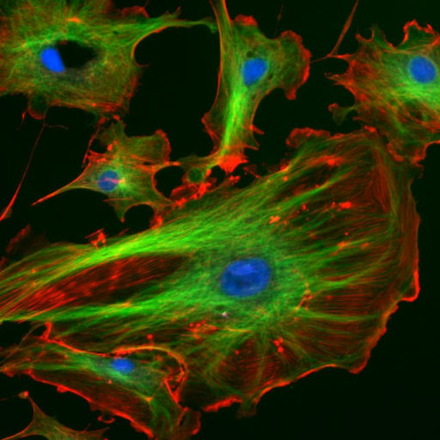

# Biological Sciences: Image Processing

 or

In this module, we will learn how to **import**, **preprocess**, and **segment biologically relevant images** using MATLAB®. Make sure you're familiar with the basics of using MATLAB by going through the [MATLAB Onramp](https://matlabacademy.mathworks.com/details/matlab-onramp/gettingstarted) before continuing. You'll need to utilize the [Image Processing Toolbox](https://www.mathworks.com/help/images/) for this module. You may want to consider going through the [Image Processing Onramp](https://matlabacademy.mathworks.com/details/image-processing-onramp/imageprocessing) for further practice. 

## Table of Contents
[Introduction](#H_6724101F)

&emsp;&emsp;[Notes on the use of live scripts](#H_DECB8235)
 
&emsp;&emsp;[Various icons will be used throughout these scripts to identify different types of interactivity.](#H_C793A640)
 
[Scripts ](#H_8128A35F)
 

Cells taken from the inner walls of a cow blood vessel, stained fluorescent, and viewed under a [microscope](https://commons.wikimedia.org/wiki/File:FluorescentCells.jpg). 

# Introduction

As biologists, we study the living world and how the species that comprise it evolve, interact, and function. You can imagine many ways in which images might be useful in biology. Images of a species of animal or plant might be used to identify various features of those organisms. Image processing can be used to monitor the health of crops, to measure the movement of humans, and can be used with machine learning techniques to diagnose different conditions such as skin cancer. An iPhone will tell you what species of plant you're looking at if you take a photo of it. If you're walking in the woods, you can instantly know if you can eat a plant or should avoid touching it altogether! We'll start this module by exploring such a plant image. 

Within organisms, we may want to look deeper than can be seen with the naked eye, which is enabled by the various types of microscopy currently used in the field. You can imagine using basic microscopy methods to look at the cells in a patient's blood, or even using more complicated microscopic imaging methods to look at the activity of cells in an alive mouse's brain! 

As techniques in biology have gotten more and more complex, biologists have begun collecting more and more data. It can be challenging to analyze all of this data by hand, but luckily MATLAB can help! For example, imagine you collect a sample of a patient's blood, and you want to count the number of cells so you can figure out if the cell count is too low, too high, etc. People used to have to painstakingly count cells by hand, but now the process can be easily automated in MATLAB by importing and segmenting an image of the slide. We'll explore how to do this at the end of this module. 

## **Notes on the use of live scripts**
-  These scripts can all be run independently, though we recommend going through these live scripts in order.  
-  These live scripts are intended to be used with output inline. To change the output, go to the **View** tab of the toolstrip, and select  **Output Inline**.  
-  If you haven't spent much time with live scripts, and need a refresher on interacting with them before you begin, click [here](matlab: edit starting_tips.mlx).  

### Various icons will be used throughout these scripts to identify different types of interactivity.

&nbsp;&nbsp;&nbsp;&nbsp;&nbsp;&nbsp;&nbsp;&nbsp;&nbsp;  Students to interact with the code . 

&nbsp;&nbsp;&nbsp;&nbsp;&nbsp;&nbsp;&nbsp;&nbsp;  **Exercises** exist in most scripts and the answers will be provided at the end.  

A problem set for students to practice these concepts is also included here. 

&nbsp;&nbsp;&nbsp;&nbsp;&nbsp;&nbsp;&nbsp;&nbsp;  Students reflect on what they've learned or on what the data means. 

&nbsp;&nbsp;&nbsp;&nbsp;&nbsp;&nbsp;&nbsp;&nbsp;  Particularly interesting examples of how these concepts are used in "real-world" biology

# Scripts 

## [Plant image segmentation](https://matlab.mathworks.com/open/github/v1?repo=MathWorks-Teaching-Resources/biosciences-Image-Processing&file=S2_Plant_img_segmentation.mlx)
-   ***Learning objective:*** Students will import,  manipulate, and segment a plant image in MATLAB, and learn how images are stored.  

## [Cell counting](https://matlab.mathworks.com/open/github/v1?repo=MathWorks-Teaching-Resources/biosciences-Image-Processing&file=S3_Cell_counting.mlx)
-   ***Learning objective:*** Students will learn to segment images by shape and count the number of cells on a microscope slide image of red blood cells. 

## [Problem set](https://matlab.mathworks.com/open/github/v1?repo=MathWorks-Teaching-Resources/biosciences-Image-Processing&file=S4_Problem_set.mlx)
-  [Problem set answers](https://matlab.mathworks.com/open/github/v1?repo=MathWorks-Teaching-Resources/biosciences-Image-Processing&file=S5_Problem_set_answers.mlx)  
